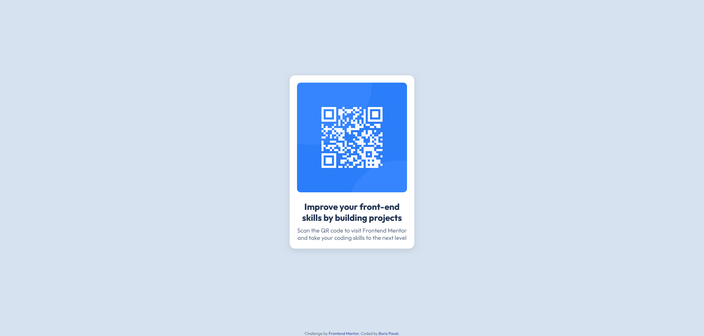

# Frontend Mentor - QR code component solution

This is a solution to the [QR code component challenge on Frontend Mentor](https://www.frontendmentor.io/challenges/qr-code-component-iux_sIO_H). Frontend Mentor challenges help you improve your coding skills by building realistic projects.

## Table of contents

- [Overview](#overview)
  - [Screenshot](#screenshot)
  - [Links](#links)
- [My process](#my-process)
  - [Built with](#built-with)
  - [What I learned](#what-i-learned)
  - [Continued development](#continued-development)
  - [Useful resources](#useful-resources)
- [Author](#author)

## Overview

### Screenshot

### Links

- Solution URL: [https://github.com/boris-pavel/qr-code-component-main](https://github.com/boris-pavel/qr-code-component-main)
- Live Site URL: [Add live site URL here](https://your-live-site-url.com)

## My process

### Built with

- Semantic HTML5 markup
- CSS custom properties
- Flexbox
- Mobile-first workflow

### What I learned

This project helped me practice structuring HTML and styling components using CSS. I learned how to create a responsive layout and apply design specifications effectively.

### Continued development

I plan to continue improving my CSS skills and explore more advanced layout techniques like CSS Grid.

### Useful resources

- [MDN Web Docs](https://developer.mozilla.org/) - Comprehensive documentation for HTML and CSS.
- [Frontend Mentor](https://www.frontendmentor.io/) - Great platform for practicing front-end development.

## Author

- Frontend Mentor - [@boris-pavel](https://www.frontendmentor.io/profile/boris-pavel)
